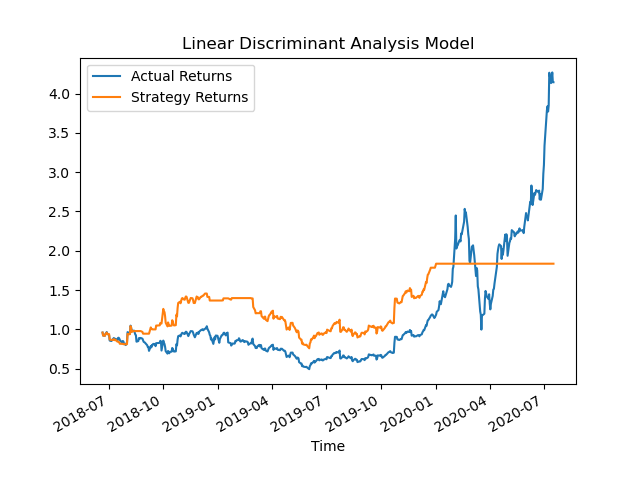

# Sentiment_Analysis_Study_Multiple_Models
UC Berkeley Fintech: Group project using multiple ML models to determine market sentiment

## Team Members
Edward Arnold, Joe Malinovsky, Alejandra Torres, Session Mwamufiya

### Model prediction Results
**Baseline investment strategy with SVC classifier:** 
SVC is well suited for binary classification of sentiment analysis 

**Investment strategy with SVC classifier and sentiment analysis:** 
SVC is well suited for binary classification of sentiment analysis 

**Investment strategy with LDA classifier and sentiment analysis:** 
LDA is well suited for linear and binary data, and adds a dimentionality reduction feature to classification of sentiment analysis 

### Presentation
[Project 2](Project_2-Group_2.pptx)

### Files
[Main Code](main.ipynb) 
[Data Construction](Code/data_pre-processing.ipynb) 
[SVC Model](Code/SVC_with_sentiment.ipynb) 
[LDA Model](Code/LDA_with_sentiment.ipynb) 
[Combined SVC and LDA Models](Code/SVC_LDA_models.py) 
[Naive Bayes](Further_Experimentation/Naive_Bayes.ipynb) 
[Experiment](Further_Experimentation/experiment_Alejandra.ipynb) 

### References
[Sentiment Analysis](https://www.youtube.com/watch?v=4OlvGGAsj8I)
